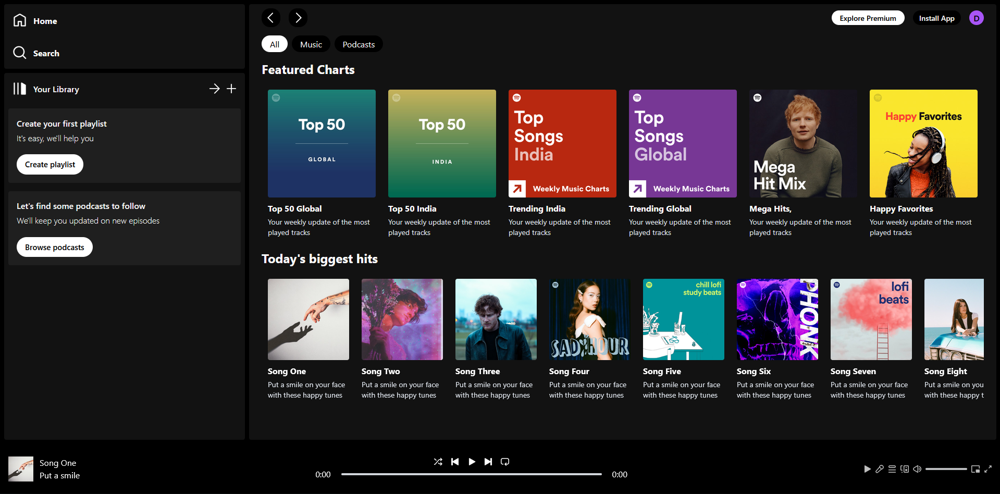

# 🎧 Spotify Clone

A fully responsive **Spotify clone** built with React and Tailwind CSS. Browse albums, play songs, control playback with a custom music player, and enjoy album pages with color-matched gradient backgrounds.

🔗 **Live Demo:** [spotify-clone-flax-rho.vercel.app](https://spotify-clone-flax-rho.vercel.app)


## ✨ Features

- 🎵 **Working music player** — play / pause / next / previous
- 🎚️ **Interactive seekbar** — click anywhere to jump in the song, live progress + time display
- 💿 **Album pages** — dynamic routes (`/album/:id`) with per-album gradient backgrounds
- 🧭 **Routing & navigation** — React Router with browser-style back/forward buttons
- 📱 **Fully responsive** — sidebar collapses on small screens, horizontal carousels
- 🧠 **Global state** — Context API controls one shared audio element from anywhere in the app

## 🛠️ Tech Stack

- [React](https://react.dev/) + [Vite](https://vite.dev/)
- [Tailwind CSS](https://tailwindcss.com/)
- [React Router DOM](https://reactrouter.com/)
- React Context API + Hooks (`useRef`, `useState`, `useEffect`, `useParams`, `useNavigate`)
- HTML5 `<audio>` API
- Deployed on [Vercel](https://vercel.com/)

## 🚀 Run it locally

```bash
git clone https://github.com/nitishengineer/spotify-clone.git
cd spotify-clone
npm install
npm run dev
```

Then open **http://localhost:5173**

## 📁 Project Structure

```
src/
├── assets/        # images, icons, MP3 files + albumsData / songsData
├── components/    # Sidebar, Player, Display, DisplayHome, DisplayAlbum,
│                  # Navbar, AlbumItem, SongItem
├── context/       # PlayerContext — global player state & audio logic
├── App.jsx        # layout + hidden <audio> element
└── main.jsx       # BrowserRouter + PlayerContextProvider
```

## 🎓 What I learned

My first complete React project — key takeaways:

- Component-driven UI and props
- Global state management with the Context API
- Controlling an HTML5 audio element through refs
- Dynamic routing and URL parameters
- Responsive design with Tailwind utility classes
- Full workflow: Git → GitHub → Vercel deployment

Built following the tutorial *"Create Spotify Clone Using React JS & Tailwind CSS"* by [GreatStack](https://www.youtube.com/@GreatStackDev), then extended and deployed independently.

## 🙌 Author

**Nitish** — [github.com/nitishengineer](https://github.com/nitishengineer)
